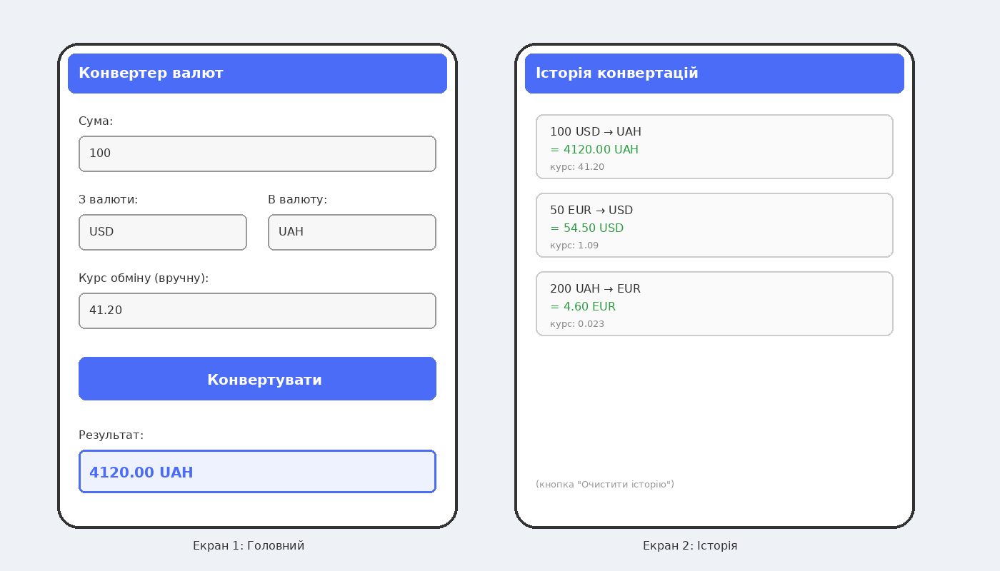

# Лабораторна робота №3
## Тема: Software Development Life Cycle (SDLC) — Життєвий цикл програмного забезпечення

**Проєкт:** Конвертер валют — ручне введення курсу й перерахунок валют

---

## 1. Планування

Мета: створити простий застосунок **«Конвертер валют»**, який дозволяє користувачу ввести суму, обрати валюту "з" і "в", вручну вказати курс обміну та миттєво отримати результат перерахунку.

Користувач повинен мати можливість вводити суму й курс обміну вручну (без підключення до зовнішніх сервісів курсів) і одразу бачити результат конвертації, а також переглядати історію попередніх розрахунків.

---

## 2. Аналіз вимог (User stories)

1. Як користувач, я хочу вводити суму та курс обміну вручну, щоб конвертувати валюту навіть без інтернету.  **(Must have)**
2. Як користувач, я хочу обирати валюту "з" і "в" зі списку, щоб конвертація була зрозумілою.  **(Must have)**
3. Як користувач, я хочу бачити результат конвертації одразу після натискання кнопки, щоб не витрачати зайвий час.
4. Як користувач, я хочу переглядати історію своїх останніх конвертацій, щоб не рахувати одне й те саме повторно.
5. Як користувач, я хочу очищати історію конвертацій, щоб список не переповнювався.

---

## 3. Дизайн (Прототип)



**Опис екранів:**
- **Екран 1 (Головний):** поля для введення суми, вибору валют "з" і "в", ручного введення курсу обміну, кнопка "Конвертувати" та блок з результатом.
- **Екран 2 (Історія):** список попередніх конвертацій із зазначенням суми, результату та використаного курсу, а також кнопка очищення історії.

---

## 4. Реалізація (Псевдокод)

```
function convertCurrency(amount, fromCurrency, toCurrency, rate):
    if amount is empty or amount <= 0:
        return "Error: Введіть коректну суму"
    if rate is empty or rate <= 0:
        return "Error: Введіть коректний курс обміну"

    result = amount * rate
    result = round(result, 2)

    saveToHistory(amount, fromCurrency, toCurrency, rate, result)

    return result + " " + toCurrency
```

---

## 5. Тестування

1. Ввести суму 100, курс 41.20 → результат 4120.00, додається у список історії.
2. Ввести порожню суму → система видає помилку "Введіть коректну суму".
3. Ввести суму 50, але залишити курс порожнім → система видає помилку "Введіть коректний курс обміну".

---

## 6. Висновки

Для конвертера валют найкраще підходить **Agile-підхід** із короткими ітераціями: спочатку реалізується базова конвертація вручну введеним курсом, а потім поступово додаються нові функції (наприклад, автоматичне підтягування курсу з API, підтримка більшої кількості валют, збереження історії в файл). Це дозволяє швидко отримувати зворотний зв'язок і адаптувати застосунок. Waterfall для такого невеликого проєкту був би занадто негнучким, а Spiral — надлишково складним з огляду на невеликий обсяг ризиків.
